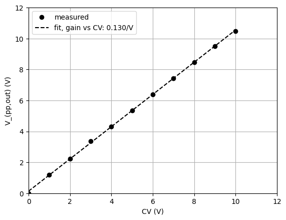

# Assembly

## Assembly Instructions

1.  Place and solder U2 (LM13700 SMT package)
2.  D1 and D2 (1N4148)
3.  Horizontal resistors R3, R6, R9, R12, R15, R18
4.  Socket for U1 (DIP-14)
5.  Disc capacitors C1, C2, C3-C5, and C7-C9
6.  Transistors Q1 and Q2 (BC557)
7.  Vertical resistors 
    
    * R1, R10
    * R2, R11, 
    * R8, R17
    * R4, R13
    * R5, R7, R14, R16, 
    * R19, R20 (ferrites)

8.  D3 and D4 (1N5819)
9.  Electrolytic capacitors C6 and C10
10. Power connector J7
11. Trim pots RV1 and RV2 (opposing orientations for equivalent trim direction)
12. Audio jacks J1-J6
13. Control pots RV3 and RV4

## Measurement and Calibration

Calibration: apply a test signal (440Hz sine, 8Vpp) to the audio input
and a DC 1V level to the CV input. Adjust the trim pot until the output
is balanced (mean voltage $\simeq 0V$).

Measurement: apply a test signal (440Hz sine, 8Vpp) to the audio input
and vary the DC level to the CV input.

  CV (V)  |Output (Vpp)  
  --------|------------
  1.0     |1.20                    
  2.0     |2.24                    
  3.0     |3.36                    
  4.0     |4.32                    
  5.0     |5.36                    
  6.0     |6.40                    
  7.0     |7.44                    
  8.0     |8.48                    
  9.0     |9.52                    
  10.0    |10.72

The linear fit of the gain response is

$$A = 0.017 + 0.13V_{cv}$$

where $A$ is the gain in V/V and $V$ is the CV input in Volts. With
$R = 56k\Omega$ in the output stage, the gain at 8V CV input is expected
to be 1.04 V/V. The measured gain at 8V CV input is 1.06 (within 2% of
expected). 

{width="480"}

## BOM

[Download (.csv)](assets/bom.csv)

