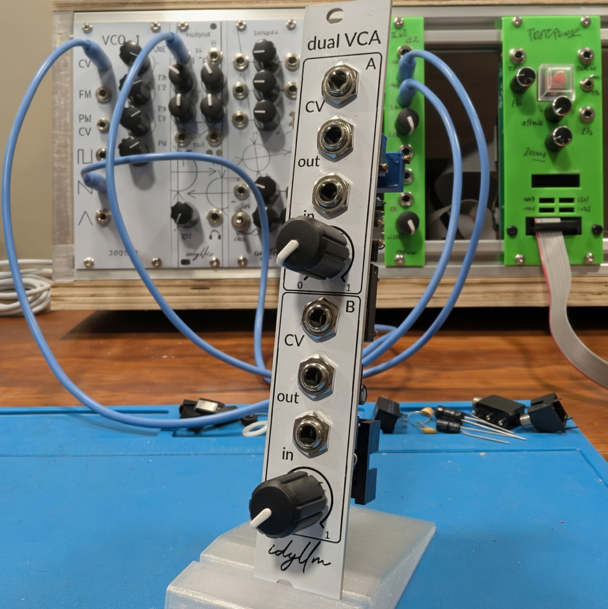

# Dual VCA

{width="400", align="right"}

A dual VCA module based on the LM13700 in the Eurorack format.

* Module size: 2HP (10mm)
* Power: 10mA (+12V); 10mA (-12V)

The control voltage (CV) of the VCA can be connected to the envelope from an ADSR. This VCA is designed to connect to the 555-based ADSRs (8V peak envelope voltage).

!!! repository "Project Source"

    The project files, including schematic and layout, are available on [github](https://github.com/xdylanm/vca-module)

## Features

The module is implemented with the LM13700 and features

* two independent DC-coupled VCAs
* audio input level control
* linear gain control with unity gain at 8V

## Documentation

[Design](theory.md)

[Assembly](assembly.md)

[Schematic](assets/schematic.pdf)

## References / Inspiration

1.  Aaron Lanterman, "ECE4450 L4.1: Voltage Controlled Amplifiers" [[youtube](https://www.youtube.com/watch?v=96j2tNKFCPI)]

