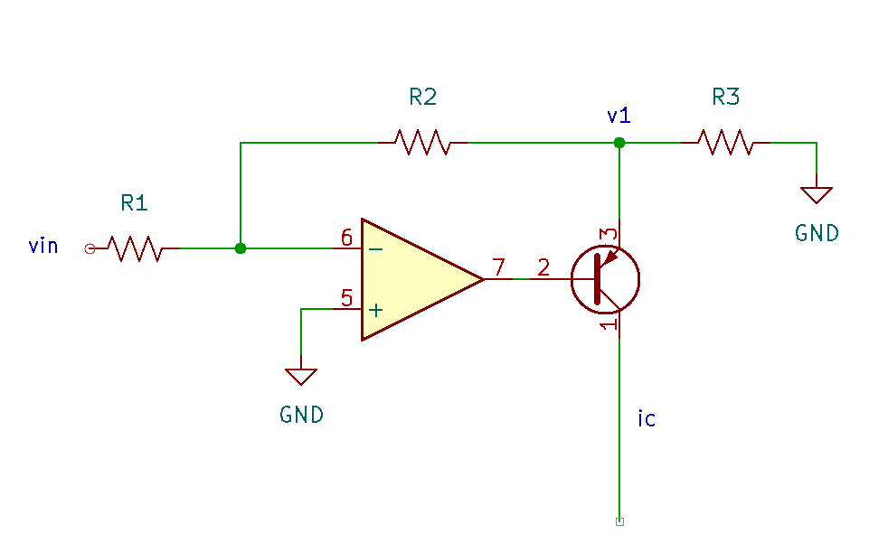
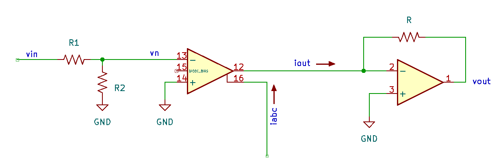

# VCA Design

Calcultions can be found in the [notebook](assets/design_calc.ipynb).

## Linear V-to-I Converter

{width="480"}

Following the derivation for the linear V-to-I converter, the output
current $I_{out}$ is found assuming

* an ideal op-amp ($v_n = v_p = 0$)
* negligible base current ($i_e = i_c + i_b \approx i_c$)

such that

$$\begin{aligned}
0 &= i_e + v_1 \left(\frac{1}{R_2} + \frac{1}{R_3}\right) \\
0 &= \frac{v_{in}}{R_1} + \frac{v_1}{R_2} \\
\to i_c \approx i_e &= v_{in}\left(\frac{R_2}{R_1}\right)\left(\frac{R_2 + R_3}{R_2 R_3}\right) \\
\to i_c &= v_{in}\left(\frac{R_2 + R_3}{R_1 R_3}\right)
\end{aligned}$$

The input CV is assumed to be a positive envelope with a range from 0 to
10V. The control current for the OTA should not exceed 1mA. The input
impedance is $R_1 = 100k\Omega$. With these constraints,

$$\begin{aligned}
\to 0.0005 &= 10\left(\frac{R_2 + R_3}{10^{5} R_3}\right) \\
\to 5 &= \frac{R_2}{R_3} + 1 \\
\to R_2 &= 4 R_3
\end{aligned}$$

Choosing $R_3 = 68k\Omega$ and $R_2 = 220k\Omega$ ensures that nominally the
current is limited to less than 500uA. A diode in the feedback loop
ensures that negative voltages are not passed to the BJT. The gain of
the CV stage is then

$$\frac{i_c}{v_{in}} = \frac{R_2 + R_3}{R_1 R_3} = 42.4 \frac{\mu A}{V}$$

and at an input level of 8V, the output current is 338.8uA.

## OTA and Output Buffer

{width="480"}

For the OTA, the transconductance is

$$g_m = \frac{i_{abc}}{2 V_T} \simeq 19.2 i_{abc}$$

where $i_{abc}$ is the amplifier bias current and the thermal voltage
$V_T = 25.6$ mV at room temperature. The output current is given by

$$\begin{aligned}
i_{out} &= g_m (v_{p} - v_n) \\
&= 19.2 i_{abc} (v_{p} - v_n) \\
\end{aligned}$$

The amplifier bias current should fall in the range of 1uA to 1mA.

For this analysis, assume that $v_p = 0$ (the non-inverting input can be
trimmed to remove any DC offset). Consequently, the output current is
$i_{out} = -19.2 i_{abc} v_n$, which then passes through the resistor
$R$ in the feedback loop of the op-amp to produce a voltage output of
(two inverting stages cancel the sign)

$$v_{out} = 19.2 i_{abc} v_n R$$

A voltage divider is used to reduce the input signal voltage:
$v_n = \frac{R_2}{R_1 + R_2} v_{in}$ with $R_2 \ll R_1$. The linear
region for the OTA is nominally in the range where
$|v_{p} - v_{n}| < 10mV$. Assuming a 10Vpp input signal, choose the
ratio for $R_2$ and $R_1$

$$\begin{aligned}
0.01 &= \frac{R_2}{R_1} 5 \\
\to R_1 &= 500 R_2
\end{aligned}$$

For $R_1 = 100k\Omega$, $R_2 = 220\Omega$ will approximately satisfy
this condition. The gain of the OTA stage is then

$$\begin{aligned}
v_{out} &\simeq 19.2 \frac{220}{10^5} i_{abc} R v_{in} \\
&= 0.04224 i_{abc} v_{in} R
\end{aligned}$$

This design will assume unity gain for the audio signal with a 8V CV
input (matching the peak voltage from a 555-based ADSR). 
With an 8V CV input, $i_{abc} = 0.339 mA$,

$$\begin{aligned}
\frac{v_{out}}{v_{in}} = 1 &= 0.04224 \times 0.339(10^{-3}) R \\
\to R &\simeq 69.9 k\Omega
\end{aligned}$$

Letting $R = 68k\Omega$ should be close enough here: the gain at 8V input CV is 0.97.

## Linear to Exponential Conversion

This section is an effort to collect theory and derivations related to linear to exponential conversion circuits. There are a few conventions to be aware of:

-   *Exponential* behaviour in circuits is often refered to as "logarithmic," e.g. "log/lin VCA". Mathemtically, it's an exponential function.
-   Voltage controlled amplifier (VCA) circuits are often referred to as "gates."
-   "Ring modulators" are equivalent to a mulitplier. The name comes from the ring of diodes used in some implementations (e.g. frequency mixers in radio applications.).

1.  Aaron Lanterman, "ECE4450 L18: Exponential Voltage-to-Current
    Conversion", [[youtube](https://www.youtube.com/watch?v=ZWJhApUmfEU)]
2.  Ken Stone, "R6 Gate (VCA)/Ring Modulator" (drawn from the Serge
    R6), [[archive](https://web.archive.org/web/20211206140530/http://serge.synth.net/modules/r6_mod/index.html)]
3.  Ray Wilson, "Dual Log/Linear VCA", [[MFOS](https://musicfromouterspace.com/analogsynth_new/DUALVCA/DLLVCA001.html)]
4.  Rene Schmitz, "A tutorial on exponential converters and temperature compensation",
    [[schmitzbits.de](https://schmitzbits.de/expo_tutorial/index.html)]
5.  Hal Chamberlain, "Musical Applications of Microprocessors", 2nd ed., Hayden Books, 1987

## References

1.  Aaron Lanterman, "ECE4450 L4.1: Voltage Controlled Amplifiers" [[youtube](https://www.youtube.com/watch?v=96j2tNKFCPI)]